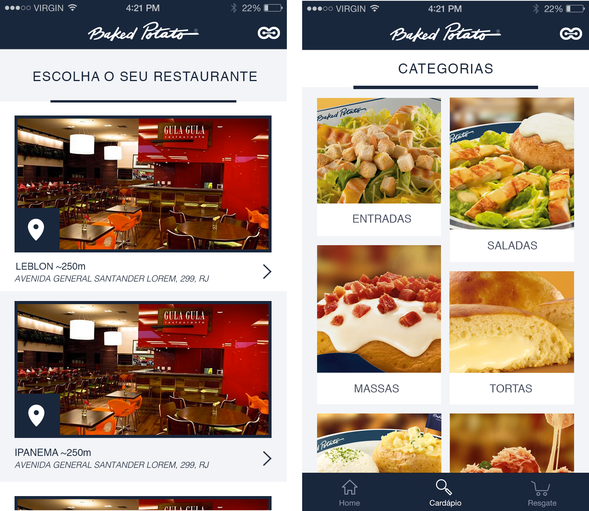
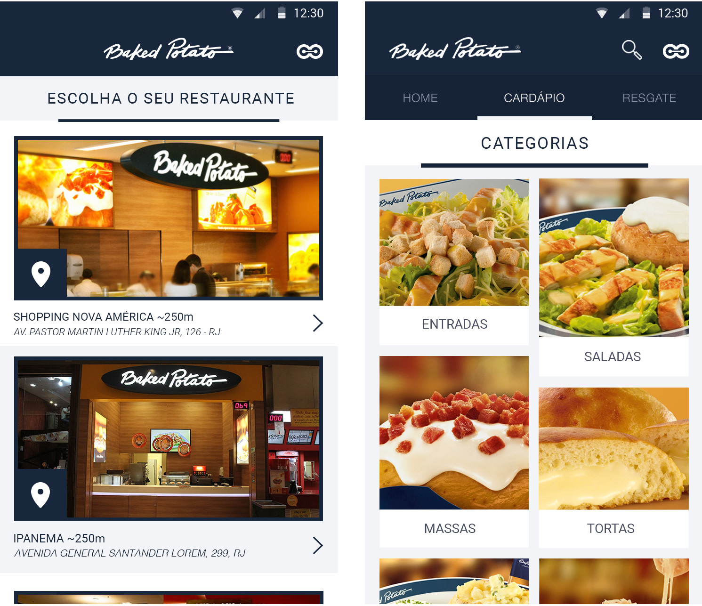

# Onyo Challenge #

Here we have some challenges for the following areas Backend, iOS and Android. Please feel free to enjoy our challenge and let us know if you have any doubts.

# Backend Challenge #

The main goal of this challenge is to exercise some concepts of API Rest, microservices and integrations. The basic goal is to create two APIs (microservices) using Django Rest Framework or similar we frameworks. These microservices should communicate with each other by JSONs, but should keep their databases separated. Both of them should answer to simple CRUD requests -- Get, Post, Put, Delete. We'll have two APIs, let's consider the first API "Ana" and the second one "Bob". When having a POST to Ana, Ana should have a POST to Bob and will save the answer of Bob on its own database. Bob should have API calls to return random values when its created, so when we have the same input coming from Ana we should have the same answer from Bob. In order to do it, Bob will have to store some data on its own database. The main reason is the needed decoupling between them.

The models, views and business rules may be created at your own criteria. We're interested on the dynamics the that these parts will connect to each other.

As a topic we have a few suggestion:
- Bob could serve Postal Code Information (Street, City, State, etc) given a Postal Code it will return information. Ana should consume Bob and propagate its answer.
- Bob could be serving Lotto Check Service. Given 6 number, Bob will tell Ana if its a winner combination or not. Ana should cache its answer in order to avoid calling Bob many times.

Fell free to follow any topic, but please make sure you have understood the purpose of its challenge.

### **Must have** ###

* Unit tests
* Integrations tests
* Documentation
* Deployment
* Clean, readable, maintainable, and extensible code 

### **Optional, but recommended** ###

* Django Rest Framework 
* Interface
* Decoupling

### **ATENTION** ###
1. Don't worry about the topic you'll chose to work on. Fell free to work on a confortable topic.
2. You should not try to push changes directly to this repository.

### **Submission Process** ###
The candidate must implement the APIs and send a Pull Request to this repository with the solution.

The Pull request process works this way:

1. The candidate forks the repository (should not clone it directly)
2. Works on the code using the forked repository.
3. Commits and push changes to the forked repository.
4. Using the GitHub interface, send the pull request.

# iOS Challenge #

The main goal of the challenge is to create an iOS app to fetch the API information of companies and categories and show them according to the provided screenshots.

### **API** ###

Company list: [http://api.staging.onyo.com/v1/mobile/brand/1/company](http://api.staging.onyo.com/v1/mobile/brand/1/company)

### **Must have** ###

* Customized UINavigationBar
* Company list
* Category list
* Follow design on the provided screenshots.
* Asynchronous and on demand image loading
* Dependency management system (CocoaPods, Gradle, ...)
* Minimum iOS version 8.0
* Swift 2.0

### **Optional, but recommended** ###

* Customized tabs
* API Communication Framework (Alamofire, ...)
* ORM Framework (CoreData, Realm, MagicRecord, ...)
* Image loading and cache Framework (SDWebImage, Alamofire, Fast Image Cache, ...)
* Unit Testing (XCTest, KIF, Kiwi, Quick, ...)
* Functional tests (Appium, UIAutomation, ...)

*The frameworks are just a suggestion. You can use any other frameworks and _surprise us_!*

### **ATENTION** ###
1. You should not try to push changes directly to this repository.

### **Submission Process** ###
The candidate must implement the app and send a Pull Request to this repository with the solution.

The Pull request process works this way:

1. The candidate forks the repository (should not clone it directly)
2. Works on the code using the forked repository.
3. Commits and push changes to the forked repository.
4. Using the GitHub interface, send the pull request.

# Android Challenge #

The main goal of the challenge is to create an Android app to fetch the API information of companies and categories and show them according to the provided screenshots.

### **API** ###

Company list: [http://api.staging.onyo.com/v1/mobile/brand/1/company](http://api.staging.onyo.com/v1/mobile/brand/1/company)

### **Must have** ###

* Customized ActionBar
* Company list
* Category list
* Asynchronous and on demand image loading
* Dependency management system (Gradle, Maven)
* Minimum SDK version must be **15**

### **Optional, but recommended** ###

* Tabs (customized or not)
* API Communication Framework (Retrofit, Volley, OkHttp, ...)
* ORM Framework (SugarORM, GreenDAO, ActiveAndroid, SquiDB, ...)
* Image loading and cache Framework (Glide, Picasso, ...)
* Annotation/Dependency Injection Framework (AndroidAnnotations, Dagger, RoboGuice, ...)
* Unit Testing (JUnit, Robolectric, ...)
* Functional tests (Robotium Solo, UIAutomator, Espresso, ...)

*The frameworks are just a suggestion. You can use any other frameworks and surprise us!*

### **ATENTION** ###
1. You don`t need to worry about the category images height. You can assume that all the images have the same height.
2. You should not try to push changes directly to this repository.

### **Submission Process** ###
The candidate must implement the app and send a Pull Request to this repository with the solution.

The Pull request process works this way:

1. The candidate forks the repository (should not clone it directly)
2. Works on the code using the forked repository.
3. Commits and push changes to the forked repository.
4. Using the GitHub interface, send the pull request.
